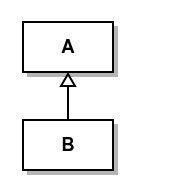
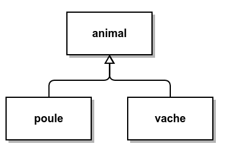
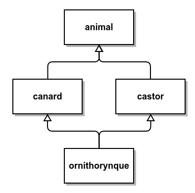
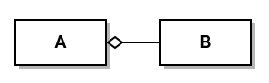
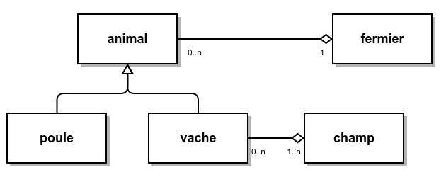
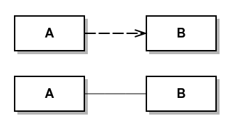
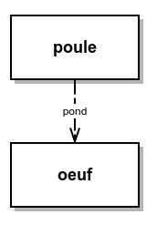
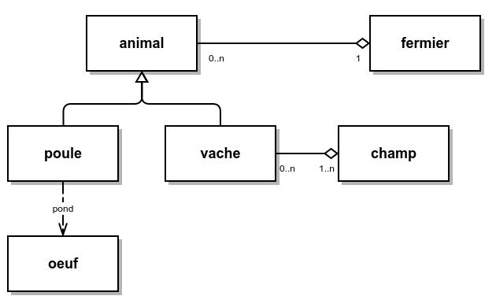
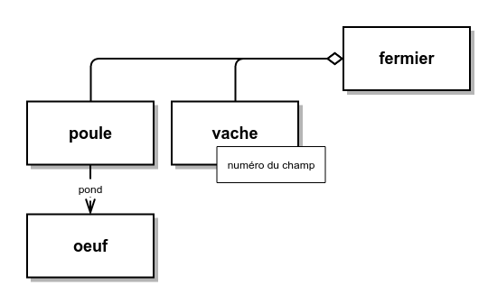

Ce présent document n'est qu'une esquisse de ce que je pense réalisable pendant mon stage. J'admets n'avoir aucune connaissances sur *CLASS* ainsi que vos contraintes de développement, par conséquent il y a sans doute des obstacles que je n'ai pas pris en compte dans mon analyse.

# Sommaire

* [Étude de la modélisation](#Étude-de-la-modélisation) (et une petite initiation à UML)
* [Qualité de code et tests](#qualité-de-code-et-tests)
* [Étude des algorithmes](#Étude-des-algorithmes)
* [Se passer de ROOT](#se-passer-de-root)

# Étude de la modélisation

* [UML](#uml)
	* [L'héritage](#lhéritage)
	* [L'agrégation](#lagrégation)
	* [Les autres connexions](#les-autres-connexions)
	* [Différence avec l'implémentation](#différence-avec-limplémentation)
* [Étude du parc électronucléaire](#Étude-du-parc-électronucléaire)
* [Étude de CLASS](#Étude-de-class)
* [Amélioration](#améliorations)

## UML

> Il ne s'agit pas de faire un cours sur tout UML, ou juste sur les diagrammes de classes, mais plus d'une initiation qui a pour but d'apprendre à lire un diagramme de classes et éventuellement en écrire des petits.

Avant de parler de code et de *CLASS* on va parler de modélisation. Dans le domaine de l'informatique on utilise souvent l'UML (ou une variante) qui est un langage graphique de modélisation, c'est-à-dire qu'il permet de représenter la modélisation d'un problème avec un diagramme.

L'avantage de ce langage est qu'il n'utilise pas d'informations implicites, il n'y a pas de vocabulaire propre à un domaine. Il permet donc de dialoguer entre deux personnes travaillant dans des disciplines différentes et de s'assurer que les deux aient bien compris la modélisation. Dans mes exemples je prendrai un cas que l'on à peu près autant l'un que l'autre : une ferme.

L'UML décrit différents types de diagrammes, le plus connu, et celui que j'utiliserai le plus ici, est le diagramme de classes. Les classes en UML sont quelque chose de plus général qu'une classe en programmation orientée objet (*C++*) mais les définitions se ressemblent : il s'agit d'une définition (un ensemble de règles, d'attributs et de méthodes) pour un ensemble d'entités (d'objets, d'instances).

### L'héritage

Il s'agit de la même forme d'héritage qu'en *C++*. Une classe *B* hérite de *A*, alors *B* a les mêmes règles que *A* mais en ajoute de nouvelles, on dit aussi que *B* est une **spécification** de *A* ou que *A* est la classe mère de *B*. Cela se représente comme suit en UML :

Le **principe de substitution de Liskov** est une principe de programmation orientée objets qui indique qu'une propriété vraie pour une classe mère *A* est aussi vraie pour une classe fille *B*. C'est-à-dire que n'importe quelle fonction qui prend en paramètre une instance de la classe *A* doit aussi pouvoir prendre un élément de la classe fille *B*. D'après ce principe on ne peut pas créer une classe *carré* qui hérite d'une classe *rectangle* car on peut librement et indépendamment modifier la longueur et la largeur d'un rectangle, chose impossible dans la classe fille *carré* (ça fait longtemps que je n'ai pas fait de géométrie euclidienne mais il me semble que dans un carré la longueur est toujours égale à la largeur).

Dans une ferme on a différents types d'animaux, des vaches et des poules, ceci va donc se représenter comme suit :

La classe *animal* contient tout ce qui est commun à une poule et une vache. On pourrait rajouter que cette classe mère peut être **abstraite**, c'est-à-dire que l'on peut définir ce qu'est un animal mais on ne peut pas créer un animal qui ne serait pas d'une espèce particulière (on ne peut pas l'*instancier*). On parle de **polymorphisme** quand on a une méthode de la classe mère qui est surchargée dans la classe fille. Dans le cas de nos vaches et nos poules on peut avoir une méthode pour `faire_du_bruit` qui va produire **meuh** dans le cas de la vache et **cot cot** dans le cas de la poule, et la méthode sera **virtuelle pure** pour l'animal en général.

L'héritage peut se faire sur plusieurs étages et une classe peut hériter de plusieurs classes. Par exemple l'avion, le bateau et l'hydravion sont des véhicules (*véhicule* est la classe mère). Un hydravion a des propriétés communes avec l'avion et le bateau, il peut donc hériter de ces deux classes. En restant dans le cadre des animaux, un ornithorynque a des propriétés communes avec le canard (le bec) et le castor (la queue). C'est un peu tordu comme exemple, mais je dois rester dans l'exemple de ma ferme.

Ce type d'héritage entre *animal*, *canard*, *castor* et *ornithorynque* est appelé **héritage en diamant**. Il est impossible dans certains langages d'effectuer ceci (par exemple en *Java*) mais l'est dans d'autres (par exemple *C++*). Une source de problèmes est que dans la classe *ornithorynque* les propriétés de *animal* sont dupliquées car héritées une première fois de *canard* et une seconde fois de *castor*. Je ne rentrerai pas dans les détails, c'est plus une indication que cela existe.

### L'agrégation

Une classe peut contenir un élément ou une **collection** d'une autre classe (ou d'elle-même dans des cas un peu spéciaux), c'est-à-dire qu'une instance d'une classe *A* va contenir une ou plusieurs instances de la classe *B*. En UML on représente ceci comme suit :

Si une instance de *A* est détruite alors la collection de *B* existe toujours. Il existe aussi un type d'agrégation appelé **composition** qui est un lien plus fort puisque dans ce cas les éléments de la collection seront détruits en même temps que la classe principale. Par simplification on confond souvent les deux.

Dans le cas de notre ferme, des vaches sont contenus dans des champs, et le fermier possède des animaux.

Si on veut être plus rigoureux il est possible aussi d'indiquer le nombre d'éléments (ou une fourchette) sur l'agrégation. Ainsi on peut indiquer qu'un champ contient plusieurs vaches, mais qu'une vache peut aussi être affectée à plusieurs champs (en fonction de la saison ou du moment de la journée). De même le fermier possède plusieurs animaux, mais ceux-ci n'appartiennent qu'à un seul fermier.

### Les autres connexions

On ne va pas s'intéresser à toutes les subtilités dans les autres types de connexions possible et on va tout regrouper en une seule forme de connexion qui est le lien. Un lien indique une dépendance entre deux classes sans que celle-ci soit un héritage ou une agrégation. C'est le cas par exemple d'une classe qui serait capable de générer des objets d'une autre classe, ou qu'une méthode d'une classe a besoin d'une instance d'une autre classe. Si le lien a une direction privilégiée on utilisera une flèche (en pointillée ou non), sinon un simple trait.

Dans notre ferme, la poule pond des oeufs.

Dans notre ferme on a donc un fermier qui possède des animaux, ceux-ci pouvant être des poules ou des vaches. Les poules pondent des oeufs et les vaches sont affectées à des prés. On peut alors représenter cette modélisation par le diagramme suivant.

### Différence avec l'implémentation

Cette modélisation peut être différente de la structure de classes de l'implémentation. En effet il peut y avoir des contraintes de développement qui t'obliges à avoir un structure plutôt qu'une autre, souvent le temps. Par exemple tu n'as pas le temps de créer une classe `animal` qui contiendrait tout ce qu'il y a de commun à une poule et une vache, ou alors tu trouves que cette classe n'est pas justifiée car tu n'as pas assez de points communs entre les deux. De plus je propose que le fermier possède un ensemble d'animaux, mais tu peux vouloir séparer le troupeau de vaches de ses poules. Plein de petits détails t'obliges à avoir une implémentation différente du modèle.

Malgré tout avoir le diagramme UML du modèle est très important car on s'assure que les différents protagonistes du projet comprennent de quoi on parle. De plus on peut réussir à penser des optimisations grâce au diagramme général avant de se mettre au code.

Les optimisations peuvent être de différents types, il y a bien entendu les optimisations en terme de performances (temps ou espace mémoire), mais on peut aussi penser à des optimisations en terme de confort de l'interface de programmation. En effet avoir une classe général pour les animaux permet de créer en *C++* un `std::vector<animal *>` ce qui permet de profiter du polymorphisme sur tous les animaux.

Un exemple du diagramme UML de classes de l'implémentation pourrait être le suivant :

On fait disparaître les classes *animal* et *champ* qui contenaient assez peu de choses. Par conséquent le fermier contient deux collections distinctes, une de poules et une de vaches. La classe *vache* contient le numéro de champ (ou une liste de numéro) auquel elle est affectée. Une critique que je ferais à cette implémentation est l'absence de la classe *animal*, le fermier peut posséder deux troupeaux distincts mais la classe *animal* permet de simplifier la manipulation des collections d'animaux.

Une autre différence qui peut exister entre le modèle théorique et le modèle de l'implémentation est le recours aux *Design patterns*. Très rapidement il s'agit de patrons de base pour résoudre certains problèmes :
* S'assurer qu'il ne peut exister qu'une seule instance d'une classe (un unique fermier dans notre exemple).
* Avoir une classe qui génère des instances d'une autre classe (la poule).
* Devoir interfacer une bibliothèque tierce avec son code (un code de simulation de vache par exemple).

Les solutions proposées demandent parfois la création de nouvelles classes abstraites simplifiant le problème.

## Étude du parc électronucélaire

Revenons au sujet du stage. Je pense que dans un premier temps il est important que l'on discute pour établir le diagramme UML de la simulation d'un parc électronucélaire, sans se soucier de l'implémentation qui en est faite dans CLASS.

Ceci me permettra de comprendre l'objectif du code, les classes de CLASS, leurs interactions et de proposer différentes optimisations globales (et pas de la simple optimisation d'algorithmes). Je pense qu'il serait trop ambicieux et contre-productif de vouloir tout ré-écrire. Par conséquent je devrais m'appuyer le plus possible sur l'existant et ne pas nécessairement vouloir tout reprendre dans la logique d'informaticien, je dois garder à l'esprit que ce code est pensé pour des physiciens.

Je n'ai pas la moindre connaissance de la physique des réacteurs, donc je ne sais pas exactement combien de temps cette étape peut prendre, mais normalement **une à deux semaines** peuvent suffire pour avoir une esquisse suffisamment complète pour continuer. Le diagramme s'affinera au fur et à mesure. Il s'agit d'avoir une vision d'ensemble, il n'est pas nécessaire dès le début de se préoccuper de petits points de détails, un modèle est quelque chose qui évolue au cours du temps.

## Étude de CLASS

Après avoir étudier le modèle théorique, il faut s'intéresser à l'implémentation qui en a été faite. Baptiste M. m'avait indiqué que par manque de temps des classes mères (comme *animal* dans l'exemple précédent) n'avaient pu être codées. Cela entraîne de la duplication de code (donc généralement la duplication de bugs, ou l'oublie d'une correction sur deux) et complexifie inutilement le code.

Il s'agit normalement de lire les déclarations de classes `class B : public A` pour avoir l'héritage, et de regarder la liste des attributs pour avoir l'agrégation. Pour les autres liaisons il faut regarder la listes des méthodes et fonctions mettant en jeu les deux classes considérées. Ça c'est la théorie, dans la pratique j'ai fouillé trop de fois dans le code de ROOT, j'ai pu voir le code de Benoît quand il codait salement, j'ai vu des esquisses du code de CLASS, et ce n'est pas toujours si simple. Seule la structure général m'intéressera dans un premier temps (pas besoin de regarder dès le début la lecture du fichier de config, je pense qu'il faut surtout s'intéresser au coeur de calculs), donc en **une semaine** j'espère que ça sera fait.

## Améliorations

Dans l'étape suivante il s'agira d'améliorer le modèle de classes de CLASS. Je ne connais pas CLASS ni vos techniques de développement, mais je pense que s'il y a des choix d'implémentation qui sont si différents du modèle théorique il doit y avoir une raison. Vu la taille de CLASS je pense qu'il n'est pas envisageable de repartir de zéro, il faut se baser sur l'existant.

Cette étape s'éloigne de l'optimisation d'algorithmes, du calcul GP/GPU, de la parallélisation etc. mais elle reste importante pour plusieurs raisons :
* L'amélioration des performances d'un algorithmes passe aussi par le choix de la structure de données.
* Il peut être plus simple de paralléliser certaines procédures en fonction les liens entre classes.
* On peut diminuer le temps de développement si la structure est plus simple et claire.

Dans cette étape il s'agira sûrement de faire du **refactoring** de code et créer des classes mères là où il y en a besoin (c'est souvent ça qui manque). Mais aussi clarifier certaines classes, peut-être remodeler certaines parties. Le travail a effectué dans cette étape dépend surtout des résultats des étapes précédentes, mais aussi de savoir s'il y a ou non la volonté de faire une refonte d'une partie de CLASS. Donc selon les besoins et la volonté de changement (je proposerai peut-être des changement qui sont mauvais et tu m'expliqueras la raison de l'implémentation actuelle) j'estime à environ *2 semaines* de travail.

# Qualité de code et tests

Je pense qu'il peut être intéressant d'utiliser mon expérience et ma formation d'informaticien pour aider à améliorer la qualité du code. Une des premières choses qu'il est possible de mettre en place sans trop boulverser l'ordre des choses, est le **développement orienté tests**.

Avant (ou après pour le code déjà écrit) de développer une fonction ou une méthode on sait ce qu'elle doit retourner dans un certain nombre de cas. Le principe du **test unitaire** est d'écrire ces cas et de tester après son implémentation si la fonction (ou méthode) respecte les tests. Par exemple si on écrit une classe *A* contenant un tableau correspondant à un signal, une des méthodes de la classe *A* est de calculer l'intégral de ce signal et une autre le maximum. Dans notre test on générera un signal basique dont on connaît le maximum et l'intégral, et on testera de façon automatique si les résultats de ces deux méthodes sont ceux espérés. On peut éventuellement tester avec différents types de signaux dont certains pouvant poser problème et on testera si la classe *A* renvoie le bon code d'erreur si une erreur doit se produire.

Souvent on se fait une petite fonction `main` qui contient un ou deux tests, on vérifie que ça tourne et c'est bon. Écrire systématiquement des tests unitaires permet de centraliser pour tous les développeurs les tests, ainsi si quelqu'un touche au code d'une fonction (correction de bug ou optimisation) le test est déjà écrit et il vérifie en même temps qu'il n'a pas cassé autre chose (ce qui arrive dans des programmes où trop de choses sont imbriquées les unes dans les autres). De plus de nombreux petits bugs qui ont des répercussions beaucoup plus loin sont évités (bugs parfois très chiants à repérer).

Pour aider à effectuer ce genre de tests il y a le *framework* de Google : `google-test`, plutôt bien fait mais il est préférable d'avoir une certaine arborescence dans son projet. On approfondira ce point pendant le stage et je pense que c'est quelque chose que l'on peut mettre en place tout au long du stage (en 6 mois ça devrait le faire ^^).

# Étude des algorithmes

On entre dans le vif du sujet (après 4 à 5 semaines de travail, soit juste après la formation sur le calcul GPU). Le travail sur les algorithmes est un peu du cas par cas, donc dans un premier temps il va être nécessaire de faire du **profiling** du programme, c'est-à-dire mesurer le temps dans chaque fonction et le nombre de fois qu'elles sont appelées, chose réalisable avec `gprof` ou `valgrind`. On observe ainsi les **goulots d'étranglement** : les fonctions critiques qui font baisser les performances du programme. Cela permet de sélectionner les algorithmes sur lesquels il faut travailler en priorité. 

Une fois cette étape réalisée on effectue un choix des morceaux sur lesquels je vais devoir travailler. L'estimation de la charge de travail est relativement difficile car elle dépend du nombre d'algorithmes et du travail à faire dessus. Mais généralement il est plus simple de transformer le code en *pseudo-code* (écriture papier de l'algo), regarder son objectif, chercher différentes méthodes pour l'optimiser (suppressions de boucles, parallélisation), voir si la structure de données est adaptée ou vérifier dans la littérature si quelqu'un n'a pas déjà eu une problématique similaire, chercher une approche différente pour résoudre le problème, on peut même faire de la méta-programmation (tu verras c'est trop cool !), ou écrire un morceau en *FORTRAN* pour gagner en performance sur du calcul vectoriel (quand je parle de *FORTRAN* je parle de *FORTRAN* "moderne" donc du *FORTRAN90*, qui est beaucoup plus digeste que son grand-frère le *FORTRAN77*).

Tout ça pour dire que je suis incapable d'indiquer un temps, même par algorithme, cela peut prendre entre une journée et 3 semaines, ça dépend de l'amélioration du gain de perf que tu souhaites et du travail à effectuer sur l'algorithme.

# Se passer de ROOT

## Point de vue de l'informaticien

Je pense qu'en tant qu'informaticien je ne reproche pas les mêmes choses à *ROOT* que toi. Moi il s'agit surtout de choix d'implémentation, de pratiques héritées du *FORTRAN*, d'une syntaxe proche de *Java* (UpperCamelCase, la notation des getters et setters, le tout pointeur mais sans delete), la non-utilisation de nombreux concepts de *C++* (templates, flux, surcharge des opérateurs, namespace), l'absence de connexion avec la STL (pourquoi recoder une string ?), l'absence de concepts de la programmation orientée objets (foncteurs, itérateurs).

Je sais que de nombreuses choses que je reproche à ROOT sont dûs à sa genèse. À l'origine *ROOT* était un agrégat de fonctions et de classes développées en *C++* ou *FORTRAN* par des physiciens du CERN que René Brun a compilé (traduit du *FORTRAN* vers le *C++* et normalisé les noms), tout ça à une époque où la STL en était qu'à ses débuts (1994), non stable, pas très complète et pas très performantes.

Bjarne Stroustrup définit 3 grandes époques du *C++*, la période *C with classes*, la période *Java-like* (dans laquelle on est encore un peu) et la période où on essaie de faire du *C++* (qui commence avec *C++11*). Depuis le début du travail sur *C++11* beaucoup de personnes souhaitent écrire du *C++* différemment, c'est à dire pas comme du *C* ni comme du *Java* mais comme du *C++*. Cela implique une utilisation intensive de la STL, ou de code qui s'en rapproche en terme d'interface et de concepts. Mais ce n'est pas parce que on travaille encore en *C++03* qu'il n'est pas possible d'écrire du beau *C++*.

## Point de vue du physicien

Après les raisons que tu sembles évoquer pour l'abandon de *ROOT* sont relativement différentes. Il s'agira surtout d'évaluer ton besoin, voir si il y a vraiment besoin de recoder tout ou voir si une bibliothèque tierce ne fait pas déjà ça (si tu demandes de recoder un outil de minimisation, je serais capable de le faire mais ça risque d'être long), puis recoder si besoin ou en tout cas l'adapter à CLASS. De même ici, ça dépend de ce que tu souhaites faire.

